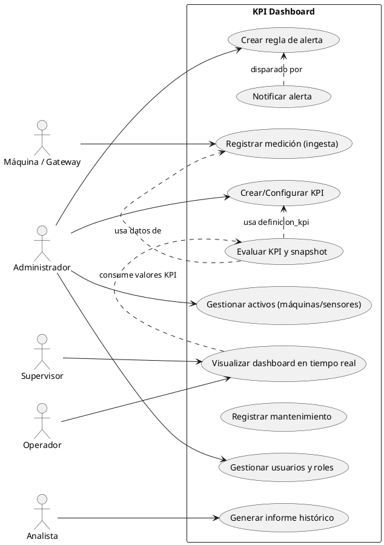

# Casos de Uso - KPI Dashboard Industrial

## Índice
1. [Resumen](#resumen)
2. [Casos de Uso Priorizados](#casos-de-uso-priorizados)
   - [1. Visualizar Dashboard en Tiempo Real](#1-visualizar-dashboard-en-tiempo-real)
   - [2. Registrar Medición desde Sensor (Ingesta)](#2-registrar-medición-desde-sensor-ingesta)
   - [3. Crear/Configurar KPI](#3-crearconfigurar-kpi)
   - [4. Evaluar KPI y Generar Snapshot](#4-evaluar-kpi-y-generar-snapshot)
   - [5. Crear Regla de Alerta y Notificar](#5-crear-regla-de-alerta-y-notificar)
   - [6. Gestionar Activos (CRUD: Máquinas y Sensores)](#6-gestionar-activos-crud-máquinas-y-sensores)
   - [7. Registrar y Gestionar Mantenimiento](#7-registrar-y-gestionar-mantenimiento)
   - [8. Generar Informe Histórico / Exportar Datos](#8-generar-informe-histórico-exportar-datos)
   - [9. Gestión de Usuarios y Roles](#9-gestión-de-usuarios-y-roles)
   - [10. Auditoría / Log de Cambios Críticos](#10-auditoría-log-de-cambios-críticos)
3. [Mapeo de Casos de Uso → Endpoints / Eventos / Consultas](#mapeo-de-casos-de-uso--endpoints-eventos-consultas)
4. [Diagrama de Casos de Uso (PlantUML)](#diagrama-de-casos-de-uso-plantuml)
5. [Criterios de Aceptación](#criterios-de-aceptación)
6. [Requisitos No Funcionales](#requisitos-no-funcionales)
7. [Siguientes Pasos Sugeridos](#siguientes-pasos-sugeridos)

## Resumen
- **Dominio**: KPI Dashboard industrial (modelo en 3FN con tablas en español).
- **Alcance**: Ingesta de datos, cálculo de KPIs, alertas, gestión de activos y usuarios, reportes históricos.
- **Tecnologías**:
  - **Backend**: Laravel (framework PHP para lógica de negocio, APIs, autenticación).
  - **Vistas**: Blade (motor de plantillas de Laravel para renderizado del frontend).
  - **Realtime**: Laravel Reverb (servidor WebSocket para actualizaciones en tiempo real).
  - **Frontend Realtime**: Laravel Echo (librería JavaScript para suscribirse a eventos WebSocket desde el frontend).
  - **Emulador/Sensores**: 
    - **Sistema de Cola**: Para buffering y reintentos (1 a n, uno a muchos).
    - **Protocolo**: HTTP con persistencia de mensajes.
    - **Redundancia**: Si el sistema se cae, los mensajes quedan en cola para reintento automático.
    - **QoS**: Garantiza entrega con reintentos exponenciales.
- **Entregable**: Casos de uso priorizados + diagrama PlantUML + mapeo a tablas.

## Casos de Uso Priorizados

### 1. Visualizar Dashboard en Tiempo Real
- **Actor(es)**: Operador, Supervisor
- **Precondiciones**:
  - Usuario autenticado y autorizado.
  - Servicio de realtime (Laravel Reverb) operativo.
  - Al menos una fuente de datos está enviando mediciones.
- **Flujo Principal**:
  1. Usuario abre app (usando Blade para vistas).
  2. Cliente establece conexión WebSocket con Laravel Reverb.
  3. Backend suscribe al broker y publica actualizaciones (mediciones, valores KPI) al cliente via Laravel Echo.
  4. UI actualiza widgets (gráficos, últimos valores, estado máquinas).
- **Flujos Alternativos**:
  - Si falla conexión realtime → fallback a polling REST (endpoint que devuelve últimas mediciones/valores).
  - Si falta dato crítico → mostrar indicador "dato no disponible" y alerta visual.
- **Postcondición**: UI muestra valores en tiempo cercano a real (latencia objetivo <1s para KPIs críticos).
- **Tablas Implicadas**: medicion (fuente de datos), valor_kpi (snapshots), maquina, sensor.
- **NFR (I4.0)**:
  - Latencia baja (<1s objetivo).
  - TLS/mTLS para conexiones.
  - Tolerancia a pérdida temporal de datos (buffering en edge).

### 2. Registrar Medición desde Sensor (Ingesta)
- **Actor(es)**: Sensor/Máquina (edge gateway/emulador), Servicio de integración
- **Precondiciones**:
  - Fuente de datos autenticada (token/credenciales).
  - Mapeo sensor <-> fila en tabla sensor ya existe.
- **Flujo Principal**:
  1. Emulador/sensor usa sistema de cola para buffering y envía mensaje por HTTP (1 a n, uno a muchos, para redundancia si el sistema se cae).
  2. Ingestor (controlador Laravel) valida payload, enriquece con metadata y escribe en tabla medicion.
  3. Ingestor publica evento a topic interno para pipeline de cálculo KPI via Laravel Reverb.
- **Flujos Alternativos / Errores**:
  - Mensaje inválido → enviar a DLQ y crear registro de error/alerta administrativa.
  - Falta mapping sensor → crear incidente y guardar payload en raw storage para análisis.
- **Postcondición**: Nueva fila en medicion; evento disparado para cómputo de KPIs.
- **Tablas Implicadas**: fuente_datos, sensor, medicion, (posible tabla de errores).
- **NFR (I4.0)**:
  - Soporte protocolos industriales (OPC-UA/MQTT via HTTP).
  - QoS en mensajería, buffering en cola del emulador, persistencia de DLQ.
  - Seguridad de credenciales y encriptación.

### 3. Crear/Configurar KPI
- **Actor(es)**: Administrador, Analista
- **Precondiciones**:
  - Usuario con permisos de administrador/analista.
  - Datos históricos suficientes para validar la definición.
- **Flujo Principal**:
  1. Admin crea definicion_kpi (código, fórmula, ventana, agregación) via formulario Blade.
  2. Admin crea instancia_kpi apuntando a tipo_objetivo (máquina/linea/planta) y define umbrales.
  3. Sistema valida sintaxis de la fórmula y la activa.
- **Flujos Alternativos**:
  - Fórmula inválida → devolver error con detalles.
  - Instancia duplicada → advertir y permitir versión.
- **Postcondición**: Filas en definicion_kpi e instancia_kpi; ready para evaluación.
- **Tablas Implicadas**: definicion_kpi, instancia_kpi, usuario (creador).
- **NFR (I4.0)**:
  - Versionado/ trazabilidad de definiciones.
  - Validación y sandbox de fórmulas para evitar cálculos costosos.

### 4. Evaluar KPI y Generar Snapshot (Cálculo Periódico o Streaming)
- **Actor(es)**: Servicio de cálculo (batch/stream en Laravel)
- **Precondiciones**:
  - Instancia_kpi activa.
  - Medidas disponibles en el window_interval.
- **Flujo Principal**:
  1. Servicio toma definicion_kpi + datos en ventana (consulta medicion).
  2. Ejecuta formula (agregación: avg/sum/...).
  3. Inserta resultado en valor_kpi (ts, valor).
  4. Si se incumple umbral, notifica a reglas de alerta asociadas via Laravel Reverb.
- **Flujos Alternativos**:
  - Datos insuficientes → marcar valor como null o quality flag.
  - Error al calcular → log/alerta y retry.
- **Postcondición**: Fila en valor_kpi; posible disparo de alerta.
- **Tablas Implicadas**: definicion_kpi, instancia_kpi, medicion, valor_kpi, regla_alerta.
- **NFR (I4.0)**:
  - Cómputo eficiente (usar materialized views/continuous aggregates).
  - Escalabilidad para mayor volumen de sensores.

### 5. Crear Regla de Alerta y Notificar
- **Actor(es)**: Administrador
- **Precondiciones**:
  - Instancia_kpi configurada.
- **Flujo Principal**:
  1. Admin crea regla_alerta (condicion json, canales_notificacion) via Blade.
  2. Sistema evalúa condición contra valor_kpi (o en streaming al recibir nuevos valores via Echo).
  3. Si la condición se cumple, se crea evento_alerta y se envían notificaciones (email, Slack, SMS).
- **Flujos Alternativos**:
  - Canal de notificación fallido → reintento y log en evento_alerta.payload.
  - Ruido excesivo → aplicar debounce o condición de persistencia.
- **Postcondición**: Fila en evento_alerta y notificaciones enviadas.
- **Tablas Implicadas**: regla_alerta, evento_alerta, usuario (destinatarios si aplica).
- **NFR (I4.0)**:
  - Notificaciones en tiempo real via Reverb/Echo.
  - Fiabilidad y deduplicación de alertas.
  - Seguridad en envío de notificaciones (no exponer datos sensibles).

### 6. Gestionar Activos (CRUD: Máquinas y Sensores)
- **Actor(es)**: Administrador, Ingeniero de planta
- **Precondiciones**:
  - Usuario con permisos.
- **Flujo Principal (Crear Máquina + Sensores)**:
  1. Crear maquina (fila en maquina) via formulario Blade.
  2. Crear sensor(s) asociado(s) (filas en sensor) y asignar fuente_datos.
  3. Validar conectividad (ping o handshake).
- **Flujos Alternativos**:
  - Duplicado etiqueta_activo → devolver error.
  - Conectividad fallida → marcar sensor offline.
- **Postcondición**: Máquinas y sensores registrados y visibles desde UI.
- **Tablas Implicadas**: maquina, sensor, fuente_datos, linea_produccion.
- **NFR (I4.0)**:
  - Integridad referencial.
  - Validaciones automáticas y pruebas de conectividad.

### 7. Registrar y Gestionar Mantenimiento
- **Actor(es)**: Operador, Supervisor, Ingeniero de mantenimiento
- **Precondiciones**:
  - Máquina existe.
- **Flujo Principal**:
  1. Crear registro_mantenimiento con inicio_ts y metadata via Blade.
  2. Durante mantenimiento, sistema puede marcar máquina como estado "en mantenimiento" (actualizar maquina.estado).
  3. Al finalizar, actualizar fin_ts y registrar actividad.
- **Flujos Alternativos**:
  - Trabajo no finalizado → registro abierto.
- **Postcondición**: Registro en registro_mantenimiento, cambio de estado en maquina si aplica.
- **Tablas Implicadas**: registro_mantenimiento, maquina, usuario.
- **NFR (I4.0)**:
  - Trazabilidad y auditoría de cambios.
  - Integración con KPIs (ej. descontar tiempo de parada del cálculo de disponibilidad).

### 8. Generar Informe Histórico / Exportar Datos
- **Actor(es)**: Analista, Supervisor
- **Precondiciones**:
  - Usuario autenticado.
  - Datos históricos disponibles (medicion/valor_kpi).
- **Flujo Principal**:
  1. Usuario solicita rango y KPIs via interfaz Blade.
  2. Backend ejecuta consultas (Timescale continuous_aggregate o agregaciones sobre medicion/valor_kpi).
  3. Genera reporte (CSV/PDF) y lo entrega o lo deja disponible.
- **Flujos Alternativos**:
  - Consulta pesada → job asíncrono y notificación cuando listo.
- **Postcondición**: Reporte generado y disponible.
- **Tablas Implicadas**: medicion, valor_kpi, maquina, instancia_kpi.
- **NFR (I4.0)**:
  - Rendimiento para consultas históricas.
  - Políticas de retención y compresión.

### 9. Gestión de Usuarios y Roles
- **Actor(es)**: Administrador
- **Precondiciones**:
  - Admin con permisos elevados.
- **Flujo Principal**:
  1. Crear/editar usuario (tabla usuario) y asignar rol (tabla rol) via Blade.
  2. Gestionar permisos con rol_permiso.
- **Flujos Alternativos**:
  - Intento de crear usuario duplicado → error.
- **Postcondición**: Cambios en usuario u rol persistidos.
- **Tablas Implicadas**: usuario, rol, permiso, rol_permiso.
- **NFR (I4.0)**:
  - Autenticación fuerte (2FA), auditoría de acceso y least privilege.

### 10. Auditoría / Log de Cambios Críticos
- **Actor(es)**: Sistema (automatizado), Auditor
- **Precondiciones**:
  - Triggers o pipeline de logging configurado.
- **Flujo Principal**:
  1. Triggers o aplicación escribe entradas de auditoría al producirse cambios (p. ej. cambios en definicion_kpi, instancia_kpi, maquina).
  2. Auditor revisa logs para cumplimiento.
- **Postcondición**: Registro de auditoría disponible.
- **Tablas Implicadas**: (Recomendar tabla audit_log) + las tablas de origen.
- **NFR (I4.0)**:
  - Integridad y no repudio, retención regulada.

## Mapeo de Casos de Uso → Endpoints / Eventos / Consultas
- **Endpoint REST para último valor por sensor**:
  GET /api/sensores/{id}/ultimo
  SQL ejemplo:
    SELECT * FROM medicion WHERE sensor_id = $1 ORDER BY ts DESC LIMIT 1;
- **Job/Servicio streaming para calcular KPI** (usando Laravel queues):
  - Consume topic: medicion_received via Reverb
  - Consulta ventana:
    SELECT avg(valor) FROM medicion WHERE sensor_id IN (...) AND ts BETWEEN now() - interval '5m' AND now();
  - Insert snapshot:
    INSERT INTO valor_kpi (instancia_kpi_id, ts, valor) VALUES ($id, now(), $valor);
- **Insert medición desde ingestor** (controlador Laravel):
  INSERT INTO medicion (sensor_id, ts, valor, calidad, payload_raw) VALUES (...);

## Diagrama de Casos de Uso (PlantUML)

## Criterios de Aceptación
- **UC2 (Registrar Medición)**:
  - Aceptación: Mensaje válido genera fila en medicion en <200 ms (desde ingestor entrando en la app).
  - Error: Mensaje inválido enviado a DLQ y logged; admin recibe notificación si >X errores/h.
- **UC4 (Evaluar KPI)**:
  - Aceptación: KPI calculado en el intervalo definido y snapshot insertado; valores duplicados no deben crearse (UNIQUE instancia_kpi_id+ts).
  - Requisitos: Tolerancia a outliers, flags de calidad.

## Requisitos No Funcionales
- **Interoperabilidad**: Soporte OPC-UA, MQTT, REST. Normalizar payloads.
- **Seguridad**: TLS/mTLS, vault para secretos, rotación credenciales, roles y least privilege.
- **Latencia**: Objetivo subsegundo para KPIs críticos; SLAs por KPI.
- **Escalabilidad**: Particionado/TSDB, clustering de brokers y servicios.
- **Resiliencia**: Buffering en cola del emulador, DLQ, retries exponenciales.
- **Gobernanza de Datos**: Lineage, quality flags, retención/archiving.

## Siguientes Pasos Sugeridos
- Generar endpoints REST/WS (especificación OpenAPI) mapeados a cada caso de uso.
- Crear ejemplos de consultas SQL y jobs (ejemplo: cálculo OEE).
- Generar migraciones / archivo .sql listo para subir y PlantUML .puml.
- Implementar pruebas de integración para ingesta y cálculo de KPI.

¿Quieres que:
1) Genere la especificación OpenAPI con endpoints para estos casos de uso?  
2) Genere el archivo .puml y .sql y abra un PR en tu repo (douglasDFH/kpi-dashboard)?  
Indica la opción y lo preparo.
